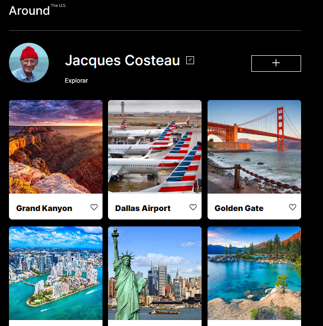

# Projeto 4: EUA Afora

  

### Visão geral
Este projeto foi criado com a finalidade de desenvolvimento de habilidades Front-END, neles são utilizadas algumas das stacks mais utilizadas atualmente no desenvolvimento web, como HTML5, CSS e JavaScript. Além do uso da ferramenta de design Figma. 
  

* Figma

* [Link para o projeto no Figma](https://www.figma.com/file/XfB6BSINvliub43JgKza1e/WEB.-Sprint-4.-Around-The-U.S.-desktop-%2B-mobile-pt)

A maneira como você fará isso no trabalho é exportando imagens diretamente do Figma — recomendamos fazer isso para praticar mais. Não se esqueça de otimizá-los [aqui](https://tinypng.com/), para que seu projeto carregue mais rápido.

Divirta-se com JavaScript!

**Imagens**

  

**Tecnologias Utilizadas**

Neste projeto foram utilizadas as seguintes tecnologias para desenvolvimento:
* HTML 5 
* CSS3 - Flexbox, Position.
* JavaScript

**Site**
* [Link para acessar o site](https://miguelterueljr.github.io/web_project_4_ptbr/)